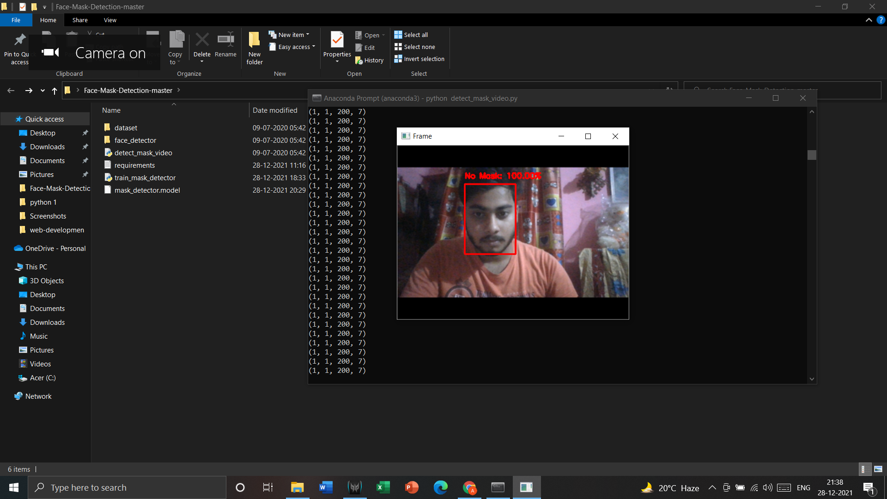
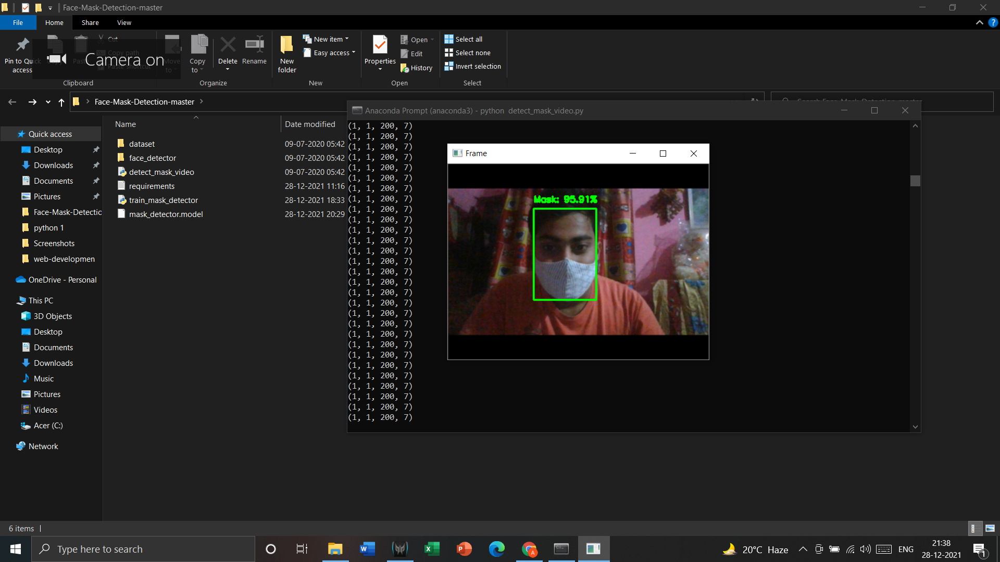

# Mask-Detection-using-mobile-net-and-opeb-cv

This is a mask detection project which is made by using mobile net for training and testing the data set and Opencv for connecting it with the camera.

 
The requirements for this project has been uploaded on the requirements.txt file
 
A dataset folder is given in which No mask and with mask images are given respectively. The images are collected from kaggle and google search.
 

 

